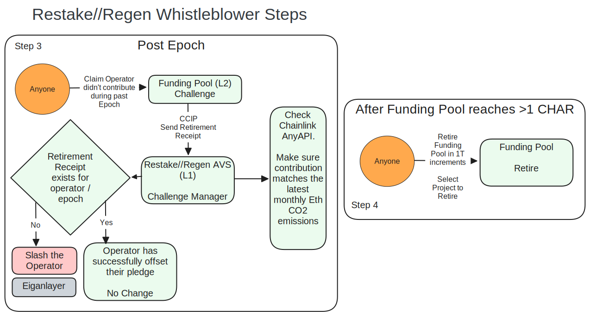

#  Restake//Regen

Check out the [validator dashboard](https://restake-regen-validator-dashboard.streamlit.app/)


An Eigenlayer AVS public good that allows Ethereum validators to pledge their commitment to offset a fraction of the network's carbon emissions by pledging to purchase and retire high-quality carbon credits.

## Overview

Protocols like Celo [can claim to be carbon neutral](https://blog.celo.org/a-carbon-negative-blockchain-its-here-and-it-s-celo-60228de36490) because the protocol itself takes a small cut of every block rewards which goes to a carbon offset fund.

Ethereum's move to proof-of-stake (PoS) cut its energy use and carbon emissions by over [8000x](https://ethereum.org/en/energy-consumption/), however the PoS network still has a over 1 Million lightweight validator nodes running various hardware, emitting roughly [2,000 Tonnes of CO2 annually across the network](https://ccaf.io/cbnsi/ethereum/ghg). 

Adding Celo-like carbon offsetting to Ethereum is impossible without a hard-fork. However, we can get a similar result using [Eigenlayer restaking and slashing mechanisms](https://www.blog.eigenlayer.xyz/ycie/) by defining an AVS (Actively Validated Service) that enforces their pledge to subsidising the energy usage of running a node by retiring high quality [Toucan Biochar (CHAR) carbon credits](https://app.toucan.earth/) on Base L2.

Validators register (opt-in) with the Restake//Regen AVS with a self-selected % pledge of the total etherium network (between 0.0001% and 1% - 1/10,000 - 1/1,000,000 of the network) and then each epoch (28 days with 13 months a year per the [International Fixed Calendar](https://en.wikipedia.org/wiki/International_Fixed_Calendar)) they must send the required amount of CHAR to the Restake//Regen Funding Pool contract, which is then retired every 1T accumulated by anyone using the open function call. The offset amount required is defined by a custom [Chainlink Any API](https://docs.chain.link/any-api/get-request/examples/array-response#example) oracle linked to the [Cambridge Blockchain Network Sustainability Index API]( https://ccaf.io/cbnsi/ethereum/ghg).

A validator must contribute CHAR to the Restake//Regen Funding Pool in a block within each epoch, and a receipt of this proof is stored in the funding pool contract storage. After the Epoch, anyone (i.e. a whistleblower) can challenge a validator through the Funding Pool, and claim they didn't make their promised contribution during the specified timeframe. If the validator did contribute, the receipt is checked and they won't be slashed. If there is no receipt during that epoch, they are slashed by the AVS. 


## Why Restake//Regen?
Web3 provides interesting solutions to the climate crisis, starting with the bridging of traditional carbon credits on chain and public good Regenerative Finance (Refi) applications.

There are a number of reasons a validator would want to pledge their carbon neutrality or negativity with Restake//Regen

1. Risk Management: By proactively addressing its carbon footprint, Ethereum can mitigate regulatory, legal, and reputational risks associated with environmental damage.
2. Differentiation and Competitive Advantage: Keep up the pace in a crowded blockchain ecosystem, to differentiate Ethereum from competitors such as Celo by leading the way in sustainability initiatives.
3. Meeting Social pressure: Feel good, Meme and Marketing and Alignment with Ethical Values
4. Long term viability of the Ethereum Network: Ethereum's energy usage and emissions are going up over time, even if the network and per validator are becoming more carbon efficient overall.
5. Cash Flow: Adds market pressure to a new class of on-chain carbon. Furthermore, allows validators to amortise their carbon emission costs monthly rather than a one-off multi-year commitment.
6. Airdrop farming NetZero Points using the Sybill Resistant WorldCoin Proof of Personhood

## Understanding Ethereum's Carbon Footprint
The Ethereum network has recently grown past 1,000,000 active validators with emissions totalling around 2000 Tonnes CO2 / year. The Ethereum network Energy and CO2 is difficult to estimate, however is predicted and distributed by the Cambridge Blockchain Network Sustainability Index (CBNSI), who provide live estimates of both energy use and carbon expenditure [with a robust methodology to account for global electricity mixes](https://ccaf.io/cbnsi/ethereum/ghg/methodology).


Figure 1: Total Ethereum Validators and Carbon Emissions. Data sources of Ethereum validator data come from [Bitquery](https://ide.bitquery.io/ETH2-validators-deposits) and the CBNSI Ethereum CO2 emissions from their [data portal](https://ccaf.io/cbnsi/ethereum/ghg) and [API](https://ccaf.io/cbeci/api/eth/pos/charts/total_greenhouse_gas_emissions/monthly). Figure was produced by [eth_carbon_statistics.py](figures/carbon-workings/eth_carbon_statistics.py)


Figure 1 shows that the number of validators and overall energy use is not constant over time. There is technically no upper maximum to number of Ethereum validators, thus we can assume that the network energy will continue to go up over time. As such, we require an Oracle to distribute the monthly carbon emissions of Ethereum on chain to Restake//Regen. 


Figure 2: CO2 Emissions per validator per epoch

The average Ethereum validator carbon emissions has dropped from 0.004TCO2 (4kg CO2) / validator / epoch in April 2023, to 0.001TCO2 (~1kg CO2) in April 2024, suggesting that the network and global energy mix is greening over time (Figure 2).

These numbers are negligible per validator, and we propose that validators may opt-in to 1x 5x, 10x, 100x, 1000x or 10,000x (roughly ~0.0001-1% of the total network) of their emissions to help green Ethereum.


## Toucan Carbon Credits


Figure 3: Toucan CHAR token price, projects and pools.

Toucan is a well trusted web3 carbon credit protocol based on bridged, real world offsets and transparent projects from Vera and Gold Standard carbon registries into TCO2 tokens and relevant carbon pools.
Toucan deployed their high quality [CHAR](https://app.toucan.earth/) pool on Base L2 in March 2024, currently priced at ~$160 USD (May 4, 2024).

Multiple offset projects area available with high transparency.

At the CHAR price of ~$160USD, the total Ethereum annual network carbon cost and 1M validators equates to roughly $320,000 USD per year, or <$0.32 per validator per year or ~2c per validator per 28 day epoch.


## Restake//Regen System Components


Figure 4: Restake//Regen Network Architecture

There are three main components to the Restake//Regen AVS. 
1. Restake//Regen AVS (Ethereum L1)
2. Chainlink AnyAPI: Oracle for live carbon emissions estimates (Ethereum L1)
3. Funding Pool (Base L2)

And two main user types:
1. Operators, also known as Validators or Stakers
2. Whistleblowers to call out non-conforming pledges can retire CHAR through Toucan in 1T incremenets from the Funding Pool.

### Workflow


Figure 4: Operator Workflow



Figure 5: Whistleblower workflow

## Major Components to review

### EigenLayer AVS

[RegenServiceManager Contract](./packages/foundry/src/RegenServiceManager.sol)

[L1 Deployment Script](./packages/foundry/script/DeployL1.s.sol)

- Basic Setup to run the full Eigenlayer stack

### Pledge Registry

[RegenPledgeRegistry Contract](./packages/foundry/src/RegenPledgeRegistry.sol)

- Sign up to the AVS
- Opt-in to a specific % of the ethereum network (between 0.0001% and 1%)

### Service Manager
A minimal interface to be an Eigenlayer AVS

### Challenge Manager
Allows anyone to challenge if an operator has not made their pledged CHAR retirements and allows an operator to cancel a challenge via CCIP. Calls into ServiceManager to perform slashing.
 - Chainlink AnyAPI connection with the CBNSI Web2 API. 

### Funding Pool (Base L2)

[FundingPool Contract](./packages/foundry/src/FundingPool.sol)

[L2 Deployment Script](./packages/foundry/script/DeployL2.s.sol)

 - `Contribute`
Allows operators to call the `Contribute` function to add CHAR tokens to the Funding Pool, and get a receipt for these CHAR tokens being retired on behalf of an operator. These tokens are pooled before burning (CHAR retirement must be in 1T increments). The Funding Pool then Stores the retirement and allows proofs of this contribution to be sent to L1, as to clear any challenges at a later date
- `Challenge`
Allows anyone, such as a whistleblower, to claim that an operator did not make their pledged commitment in a previous epoch, by checking the Retirement Receipts. Invokes the L1 Challenge Manager.
- `Retire`
Allows anyone to retire the entire FundingPool CHAR credits (Minimum 1T)
- `Retirement Receipts`
Storage of operator contribution receipts, to be used during Challenge acted on L1. 


### Worldcoin ID Points System

[Proof generation on registration](./packages/nextjs/app/forms/RegisterPledgeForm.tsx)

[RegenPledgeRegistry Contract](./packages/foundry/src/RegenPledgeRegistry.sol)

We use Worldcoin Proof of Personhood for sybil restistance to our non-linear points system.
Restake//Regen AVS stakers receive bonus points on on signup, and rewards over time for their ongoing climate pledge and retirement of CHAR carbon offsets.

$$\textrm{NetZeroPoints} = \textrm{SignupBonus}+\int_{t_{signup}}^t \textrm{stake}~dt $$

### The AVS Slashing flow (from Base Sepolia to Sepolia)

[Sender on L2](./packages/foundry/src/FundingPool.sol)

[Receiver on L1](./packages/foundry/src/RegenChallengeManager.sol)

We use the Chainlink CCIP as part of the challenge flow to route the receipt data from Bas2 L2 to Ethereum L1 where the slashing can take place. The data is only sent as needed and the L1 contract determines if the slashing challenge is valid or not. 


1. Base Sepolia
    - Whistleblower calls contract on Base Sepolia passing epoch and validator/operator address they want to attempt to slash
    - contract reads from storage the amount that operator deposited for the given epoch
    - This is sent to the CCIP router with the target address given as our ChallengeManager contract on Sepolia L1

2. Ethereum Sepolia L1

    - CCIP receiver calls into our slasher contract with the "evidence". `ChallengeManager` contract checks if this constitues a slashable offence (e.g. epoch has ended, amount is less than pledged by validator) and slashes the given validators staked Ethereum if they did not meet their pledge.

### Web forms for demo

[UI Interaction Forms](./packages/nextjs/app/forms/)

## Running Restake//Regen

To build the contracts and deploy them to their respective test networks run

```shell
cd packages/foundry
yarn deploy-l1-sepolia  
yarn yarn deploy-l2-base-sepolia  
```

This will also updates their addresses in the web interface.

---

To locally host the web interface, from the repo root run

```shell
yarn start
```

## Running the Validator Dashboard
The validator dashboard should easily be run through two shell scripts
1. `sh install_poetry.sh`
2. `sh run_validator_dashboard.sh`


## Screenshots


Cambridge Blockchain Ethereum Carbon Estimates


## Built with

- [scaffold-eth-2](https://github.com/scaffold-eth/scaffold-eth-2)
- [Foundry](https://github.com/foundry-rs/foundry)
- [Streamlit](https://streamlit.io/)
